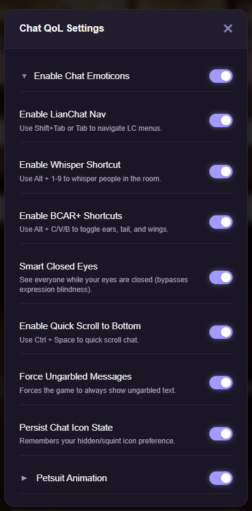
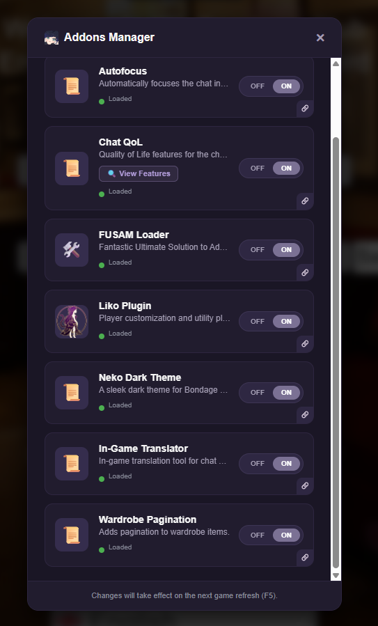
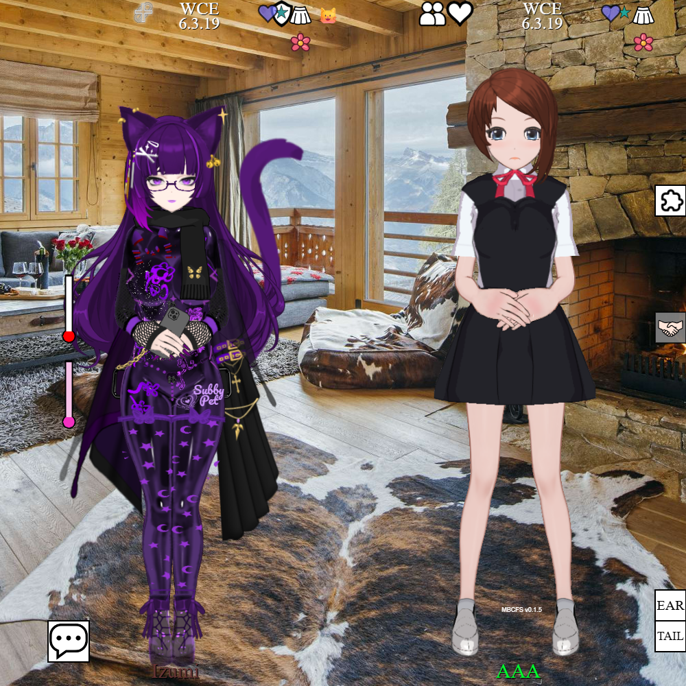
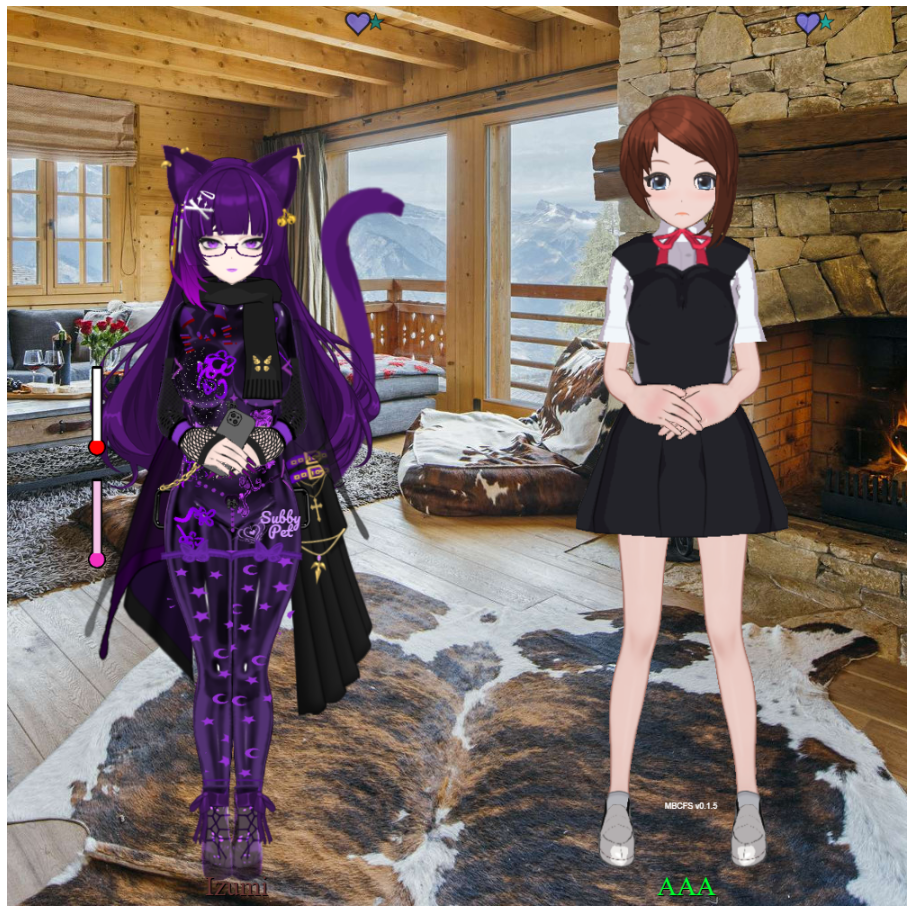
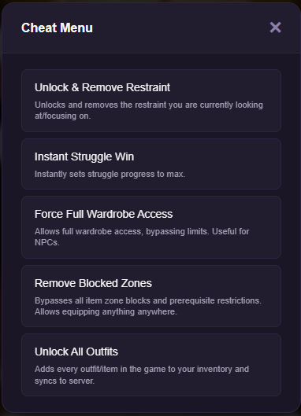

<div align="center">
  
  <h1>BC Desktop</h1>
  <p>Lightweight, native desktop client for BC</p>

  <p>
    
    
    
    
  </p>
</div>

---

A minimal native desktop wrapper for BC, built with **WPF** and **.NET 8**. Uses the OS native webview (Edge WebView2) — no bundled Chromium — keeping the RAM footprint and CPU usage as small as possible.

## Features

- **Auto-detects the latest game version** on every launch
- **OTA (Over-the-Air) Remote Loader**: All addons and scripts are fetched automatically from GitHub on startup. You never need to re-download the desktop app just to get script updates!
- **Borderless custom title bar** with seamless drag, minimize, maximize, and close
- **Sleeping Tabs (Suspend on minimize)** to drastically reduce RAM while in background
- **Multi-monitor support** with proper DPI scaling bounds
- **Discreet / Stealth** design for Task Manager and Taskbar

## Included Scripts / Addons

This repository also hosts standalone scripts in the `Scripts/` folder. You can use them directly via Tampermonkey or Bookmarklets even without the Desktop App:

### 1. Neko Dark Mode (`neko-dark.js`)

A custom dark mode theme designed specifically for **Neko Chat Enhancer**.


**Design Highlights:**

- **Deep Purple Aesthetic:** Replaces the default harsh black/white with a sleek, unified dark purple palette that feels premium and is much easier on the eyes.
- **Refined Background Overlay:** The floating heart (love) particles in the background are tweaked with custom opacity and blend modes, giving a subtle and beautiful half-screen ambiance without distracting from the chat.
- **Improved Readability:** Action texts, whispers, and chat borders have been re-colored to stand out elegantly against the dark background.

**Prerequisite:**
Because this is a theme for **Neko Chat Enhancer**, you must have the original addon by _QAQMOON_ installed and enabled first.


**How to Install:**

#### Bookmarklet (One-Click)

```javascript
javascript: (function () {
    var script = document.createElement("script");
    script.src =
        "https://cdn.jsdelivr.net/gh/Izumii99/BC-Desktop@main/Scripts/neko-dark.js?v=" +
        Date.now();
    document.head.appendChild(script);
    console.log("Fetching Neko Dark from GitHub...");
})();
```

#### Tampermonkey, ViolentMonkey, etc. (Auto-Loader)

```javascript
// ==UserScript==
// @name         Neko Addons (Auto-Loader)
// @namespace    http://tampermonkey.net/
// @version      1.0
// @description  Neko Chat Enhancer dark mode
// @author       Izumii99
// @match        https://*.bondageprojects.elementfx.com/*
// @match        https://*.bondage-europe.com/*
// @match        https://*.bondageprojects.com/*
// @match        https://*.bondage-asia.com/*
// @grant        none
// ==/UserScript==

(function () {
    "use strict";
    var script = document.createElement("script");
    script.src =
        "https://cdn.jsdelivr.net/gh/Izumii99/BC-Desktop@main/Scripts/neko-dark.js?v=" +
        Date.now();
    document.head.appendChild(script);
    console.log("Neko Addons Loader: Injected successfully!");
})();
```

### 2. Wardrobe & Appearance Pagination (`wardrobe-pagination.js`)

> [!NOTE]
> **OFFICIALLY MERGED INTO BCX!**
> This script was originally created as a standalone mod to fix the wardrobe overflow issue. We are incredibly proud to announce that the underlying logic has now been **natively integrated into the official Bondage Club Extended (BCX) repository!**
>
> You no longer need to install this script if you are using the latest version of BCX. The pagination is now a core feature! 🎉

Fixes the issue where having too many clothing items (e.g. from using multiple mods) causes the item list to overflow beyond the right side of the screen, making them impossible to click.

<p float="left">
  
  
</p>

_The standalone script remains in this repository as a historical backup/archive, but no manual installation is required anymore._

### 3. Chat QoL & Emoticons (`chat-qol.js`)

A massive quality-of-life upgrade for the chat system that seamlessly translates text emoticons into actual 3D character facial expressions, and more.



**Features:**

- **Text-to-Expression Emoticons:** Typing text like `:)`, `>:(`, `;p`, `><`, `=///=` or even `>3<` automatically changes your character's Eyes, Mouth, Eyebrows, Blush, and Tears to match the emoticon! No need to manually click the expression menu ever again.
- **Floating Emoticons:** Using `!`, `?`, or `#` alongside an emoticon triggers the Exclamation, Confusion, or Annoyed floating icons above your character. Type `brb` or `afk` to permanently display the BRB/AFK icon until you return.
- **Force Ungarbled Messages:** Automatically enables the "Show Ungarbled Messages" immersion setting so you can always read what others are saying even through gags.
- **Persistent Hide Icon:** Remembers if you clicked the eye icon to hide the chat UI and keeps it hidden even after the game reloads.
- **Keyboard Shortcuts:**
    - `Ctrl + Space`: Scroll chat to bottom.
    - `Shift + Tab` / `Tab`: Navigate LianChat friends.
    - `Alt + Number (1-9)`: Whisper to characters in the room based on their position.

**How to Install:**

#### Bookmarklet (One-Click)

```javascript
javascript: (function () {
    var script = document.createElement("script");
    script.src =
        "https://cdn.jsdelivr.net/gh/Izumii99/BC-Desktop@main/Scripts/chat-qol.js?v=" +
        Date.now();
    document.head.appendChild(script);
    console.log("Fetching Chat QoL from GitHub...");
})();
```

#### Tampermonkey, ViolentMonkey, etc. (Auto-Loader)

```javascript
// ==UserScript==
// @name         Chat QoL & Emoticons (Auto-Loader)
// @namespace    http://tampermonkey.net/
// @version      1.0
// @description  Text-to-expression emoticons and chat shortcuts for Bondage Club
// @author       Izumii99
// @match        https://*.bondageprojects.elementfx.com/*
// @match        https://*.bondage-europe.com/*
// @match        https://*.bondageprojects.com/*
// @match        https://*.bondage-asia.com/*
// @grant        none
// ==/UserScript==

(function () {
    "use strict";
    var script = document.createElement("script");
    script.src =
        "https://cdn.jsdelivr.net/gh/Izumii99/BC-Desktop@main/Scripts/chat-qol.js?v=" +
        Date.now();
    document.head.appendChild(script);
    console.log("Chat QoL Loader: Injected successfully!");
})();
```

### 4. Addon Manager UI (`addon-manager.js`)

A built-in GUI to manage all your installed BC Desktop addons and compatible community scripts in one place.



**Features:**

- Provides a floating quick-access button inside the game (available in the login screen, profile, etc.).
- Allows you to easily toggle scripts ON or OFF without messing with Tampermonkey or bookmarklets again.
- Automatically fetches and updates scripts from the repository.

**How to Install:**

#### Bookmarklet (One-Click)

```javascript
javascript: (function () {
    var script = document.createElement("script");
    script.src =
        "https://cdn.jsdelivr.net/gh/Izumii99/BC-Desktop@main/Scripts/addon-manager.js?v=" +
        Date.now();
    document.head.appendChild(script);
    console.log("Fetching Addon Manager from GitHub...");
})();
```

#### Tampermonkey, ViolentMonkey, etc. (Auto-Loader)

```javascript
// ==UserScript==
// @name         BC Desktop Addon Manager
// @namespace    http://tampermonkey.net/
// @version      1.0
// @description  Manages BC Desktop addons with a built-in UI
// @author       Izumii99
// @match        https://*.bondageprojects.elementfx.com/*
// @match        https://*.bondage-europe.com/*
// @match        https://*.bondageprojects.com/*
// @match        https://*.bondage-asia.com/*
// @grant        none
// ==/UserScript==

(function () {
    "use strict";
    var script = document.createElement("script");
    script.src =
        "https://cdn.jsdelivr.net/gh/Izumii99/BC-Desktop@main/Scripts/addon-manager.js?v=" +
        Date.now();
    document.head.appendChild(script);
    console.log("Addon Manager Loader: Injected successfully!");
})();
```

### 5. Screenshot Cleaner (`screenshot-cleaner.js`)

A must-have utility for taking perfectly clean photos. Every screenshot taken in-game will automatically remove all addon buttons, sliders, and overlays, so there's no need to hide them manually!

<p float="left">
  
  
</p>

**Features:**

- Seamlessly drops every third-party button and addon overlay from the captured frame.
- Keeps in-game photos limited strictly to the characters, their arousal meters, and the room.
- Works securely at the canvas render level via `bcModSdk`.

**How to Install:**

#### Bookmarklet (One-Click)

```javascript
javascript: (function () {
    var script = document.createElement("script");
    script.src =
        "https://cdn.jsdelivr.net/gh/Izumii99/BC-Desktop@main/Scripts/screenshot-cleaner.js?v=" +
        Date.now();
    document.head.appendChild(script);
    console.log("Fetching Screenshot Cleaner from GitHub...");
})();
```

#### Tampermonkey, ViolentMonkey, etc. (Auto-Loader)

```javascript
// ==UserScript==
// @name         Screenshot Cleaner
// @namespace    http://tampermonkey.net/
// @version      2.0
// @description  Keeps in-game photos limited to the characters, their arousal meters and the room.
// @author       Izumii99
// @match        https://*.bondageprojects.elementfx.com/*
// @match        https://*.bondage-europe.com/*
// @match        https://*.bondageprojects.com/*
// @match        https://*.bondage-asia.com/*
// @grant        none
// ==/UserScript==

(function () {
    "use strict";
    var script = document.createElement("script");
    script.src =
        "https://cdn.jsdelivr.net/gh/Izumii99/BC-Desktop@main/Scripts/screenshot-cleaner.js?v=" +
        Date.now();
    document.head.appendChild(script);
    console.log("Screenshot Cleaner Loader: Injected successfully!");
})();
```

### 6. Cheat Menu (`cheat-menu.js`)

A lightweight floating cheat menu that provides various shortcuts and utilities for testing and fun. _(Please give me more cheat so I can add that doesn't exist at ULTRABC or even mine work)_



**Features:**

- Quick-access floating draggable menu.
- Easily toggle invulnerability, instant escape, add money, and more.
- Perfect for debugging, modding, or just playing around without grinding.

**How to Install:**

#### Bookmarklet (One-Click)

```javascript
javascript: (function () {
    var script = document.createElement("script");
    script.src =
        "https://cdn.jsdelivr.net/gh/Izumii99/BC-Desktop@main/Scripts/cheat-menu.js?v=" +
        Date.now();
    document.head.appendChild(script);
    console.log("Fetching Cheat Menu from GitHub...");
})();
```

#### Tampermonkey, ViolentMonkey, etc. (Auto-Loader)

```javascript
// ==UserScript==
// @name         Cheat Menu
// @namespace    http://tampermonkey.net/
// @version      1.0
// @description  A lightweight floating cheat menu for Bondage Club
// @author       Izumii99
// @match        https://*.bondageprojects.elementfx.com/*
// @match        https://*.bondage-europe.com/*
// @match        https://*.bondageprojects.com/*
// @match        https://*.bondage-asia.com/*
// @grant        none
// ==/UserScript==

(function () {
    "use strict";
    var script = document.createElement("script");
    script.src =
        "https://cdn.jsdelivr.net/gh/Izumii99/BC-Desktop@main/Scripts/cheat-menu.js?v=" +
        Date.now();
    document.head.appendChild(script);
    console.log("Cheat Menu Loader: Injected successfully!");
})();
```

## Why not Electron?

|                            | Electron / Web Browser | BC Desktop (WPF)                    |
| -------------------------- | ---------------------- | ----------------------------------- |
| **Bundled Browser**        | Chromium (~150 MB)     | OS native (WebView2)                |
| **CPU (Active Playing)**   | ~3% – 15%              | ~1% – 5%                            |
| **RAM (Active Playing)**   | ~700 MB – 1.2 GB       | ~500 MB – 650 MB                    |
| **RAM (Idle/Background)**  | ~300 MB – 500 MB       | ~100 MB – 250 MB (Sleeping Tabs)    |
| **App Size (Lightweight)** | ~100–200 MB            | ~4 MB                               |
| **App Size (Standalone)**  | ~100–200 MB            | ~160 MB (Contains .NET, no Browser) |

## Requirements

- **Windows 10/11**
- **WebView2 Runtime** (already pre-installed on most modern Windows systems)
- **[.NET 8 Desktop Runtime](https://dotnet.microsoft.com/en-us/download/dotnet/8.0)** _(Only required if using the Lightweight build)_

## Building from Source

Prerequisites: [.NET 8 SDK](https://dotnet.microsoft.com/en-us/download/dotnet/8.0)

```powershell
git clone https://github.com/Izumii99/BC-Desktop.git
cd BC-Desktop
dotnet restore
dotnet build -c Release
```

## Publishing (Lightweight vs Standalone)

**Option 1: Lightweight (~3MB, requires .NET 8 Runtime installed)**

```powershell
dotnet publish -c Release -r win-x64 --self-contained false -p:PublishSingleFile=true -o .\publish\Lightweight
```

**Option 2: Standalone (~162MB, fully self-contained)**

```powershell
dotnet publish -c Release -r win-x64 --self-contained true -p:PublishSingleFile=true -p:IncludeNativeLibrariesForSelfExtract=true -o .\publish\Standalone
```

## Project Structure

```text
BC-Desktop.csproj   — Build configuration
App.xaml / .cs      — Entry point & global settings
MainWindow.xaml     — Borderless window layout
MainWindow.xaml.cs  — WebView2 init, version detection, memory management
Assets/             — Contains app_logo.png and app.ico
Scripts/            — Mod/addon scripts directory
```
