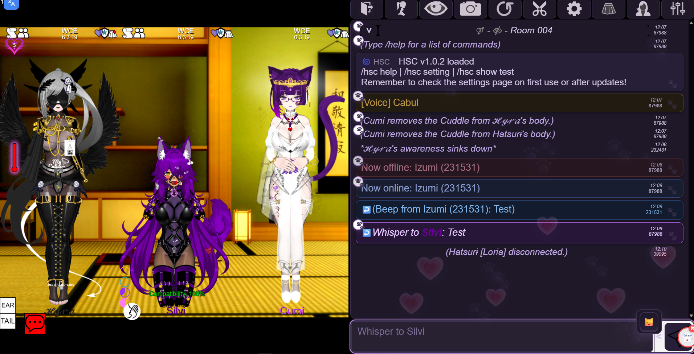
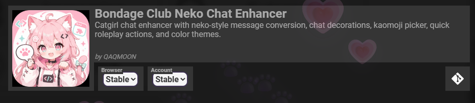
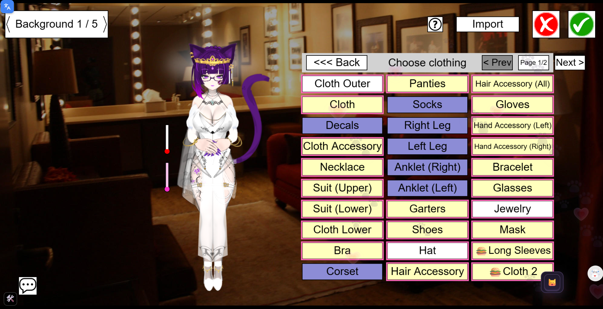
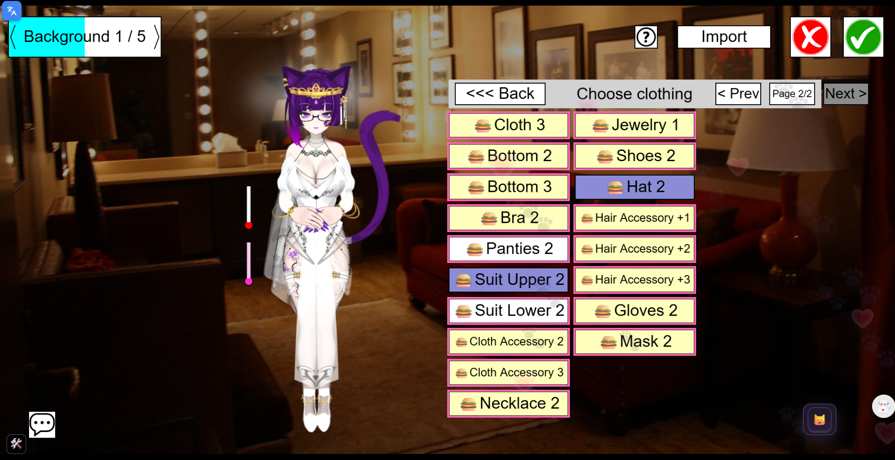

<div align="center">
  
  <h1>BC Desktop</h1>
  <p>Lightweight, native desktop client for BC</p>

  <p>
    
    
    
    
  </p>
</div>

---

A minimal native desktop wrapper for BC, built with **WPF** and **.NET 8**. Uses the OS native webview (Edge WebView2) — no bundled Chromium — keeping the RAM footprint and CPU usage as small as possible.

## Features

- **Auto-detects the latest game version** on every launch
- **Addon loader** injected automatically on page load
- **Borderless custom title bar** with seamless drag, minimize, maximize, and close
- **Sleeping Tabs (Suspend on minimize)** to drastically reduce RAM while in background
- **Multi-monitor support** with proper DPI scaling bounds
- **Discreet / Stealth** design for Task Manager and Taskbar

## Included Scripts / Addons

This repository also hosts standalone scripts in the `Scripts/` folder. You can use them directly via Tampermonkey or Bookmarklets even without the Desktop App:

### 1. Neko Dark Mode (`neko-dark.js`)
A custom dark mode theme designed specifically for **Neko Chat Enhancer**. 



**Design Highlights:**
- **Deep Purple Aesthetic:** Replaces the default harsh black/white with a sleek, unified dark purple palette that feels premium and is much easier on the eyes.
- **Refined Background Overlay:** The floating heart (love) particles in the background are tweaked with custom opacity and blend modes, giving a subtle and beautiful half-screen ambiance without distracting from the chat.
- **Improved Readability:** Action texts, whispers, and chat borders have been re-colored to stand out elegantly against the dark background.

**Prerequisite:** 
Because this is a theme for **Neko Chat Enhancer**, you must have the original addon by *QAQMOON* installed and enabled first.



**How to Install:**

#### Bookmarklet (One-Click)

```javascript
javascript:(function(){
    var script = document.createElement('script');
    script.src = 'https://cdn.jsdelivr.net/gh/Izumii99/BC-Desktop@main/Scripts/neko-dark.js';
    document.head.appendChild(script);
    console.log('Menarik Neko Dark dari GitHub...');
})();
```

#### Tampermonkey, ViolentMonkey, etc. (Auto-Loader)

```javascript
// ==UserScript==
// @name         Neko Addons (Auto-Loader)
// @namespace    http://tampermonkey.net/
// @version      1.0
// @description  Neko Chat Enhancer dark mode
// @author       Izumii99
// @match        https://*.bondageprojects.elementfx.com/*
// @match        https://*.bondage-europe.com/*
// @match        https://*.bondageprojects.com/*
// @match        https://*.bondage-asia.com/*
// @grant        none
// ==/UserScript==

(function() {
    'use strict';
    var script = document.createElement('script');
    script.src = 'https://cdn.jsdelivr.net/gh/Izumii99/BC-Desktop@main/Scripts/neko-dark.js?v=' + Date.now();
    document.head.appendChild(script);
    console.log("Neko Addons Loader: Injected successfully!");
})();
```

### 2. Wardrobe & Appearance Pagination (`wardrobe-pagination.js`)
Fixes the issue where having too many clothing items (e.g. from using multiple mods) causes the item list to overflow beyond the right side of the screen, making them impossible to click.

<p float="left">
  
  
</p>

**Features:**
- Seamlessly paginates the Appearance grid into multiple manageable pages.
- Native UI integration with Next/Prev and Page Indicator buttons.
- Fully compatible with Wardrobe decorators and active item selection (pink borders).
- Hooked securely into the game's render loop without altering DOM elements.

**How to Install:**

#### Bookmarklet (One-Click)

```javascript
javascript:(function(){
    var script = document.createElement('script');
    script.src = 'https://cdn.jsdelivr.net/gh/Izumii99/BC-Desktop@main/Scripts/wardrobe-pagination.js';
    document.head.appendChild(script);
    console.log('Menarik Wardrobe Pagination dari GitHub...');
})();
```

#### Tampermonkey, ViolentMonkey, etc. (Auto-Loader)

```javascript
// ==UserScript==
// @name         Wardrobe Pagination (Auto-Loader)
// @namespace    http://tampermonkey.net/
// @version      1.0
// @description  Adds pagination to Bondage Club's appearance menu
// @author       Izumii99
// @match        https://*.bondageprojects.elementfx.com/*
// @match        https://*.bondage-europe.com/*
// @match        https://*.bondageprojects.com/*
// @match        https://*.bondage-asia.com/*
// @grant        none
// ==/UserScript==

(function() {
    'use strict';
    var script = document.createElement('script');
    script.src = 'https://cdn.jsdelivr.net/gh/Izumii99/BC-Desktop@main/Scripts/wardrobe-pagination.js?v=' + Date.now();
    document.head.appendChild(script);
    console.log("Wardrobe Pagination Loader: Injected successfully!");
})();
```

## Why not Electron?

|                            | Electron / Web Browser | BC Desktop (WPF)                    |
| -------------------------- | ---------------------- | ----------------------------------- |
| **Bundled Browser**        | Chromium (~150 MB)     | OS native (WebView2)                |
| **CPU (Active Playing)**   | ~3% – 15%              | ~1% – 3%                            |
| **RAM (Active Playing)**   | ~700 MB – 1.2 GB       | ~500 MB – 650 MB                    |
| **RAM (Idle/Background)**  | ~300 MB – 500 MB       | ~50 MB – 150 MB (Sleeping Tabs)     |
| **App Size (Lightweight)** | ~100–200 MB            | ~3 MB                               |
| **App Size (Standalone)**  | ~100–200 MB            | ~160 MB (Contains .NET, no Browser) |

## Requirements

- **Windows 10/11**
- **WebView2 Runtime** (already pre-installed on most modern Windows systems)
- **[.NET 8 Desktop Runtime](https://dotnet.microsoft.com/en-us/download/dotnet/8.0)** _(Only required if using the Lightweight build)_

## Building from Source

Prerequisites: [.NET 8 SDK](https://dotnet.microsoft.com/en-us/download/dotnet/8.0)

```powershell
git clone https://github.com/Izumii99/BC-Desktop.git
cd BC-Desktop
dotnet restore
dotnet build -c Release
```

## Publishing (Lightweight vs Standalone)

**Option 1: Lightweight (~3MB, requires .NET 8 Runtime installed)**

```powershell
dotnet publish -c Release -r win-x64 --self-contained false -p:PublishSingleFile=true -o .\publish\Lightweight
```

**Option 2: Standalone (~162MB, fully self-contained)**

```powershell
dotnet publish -c Release -r win-x64 --self-contained true -p:PublishSingleFile=true -p:IncludeNativeLibrariesForSelfExtract=true -o .\publish\Standalone
```

## Project Structure

```text
BC-Desktop.csproj   — Build configuration
App.xaml / .cs      — Entry point & global settings
MainWindow.xaml     — Borderless window layout
MainWindow.xaml.cs  — WebView2 init, version detection, memory management
Assets/             — Contains app_logo.png and app.ico
Scripts/            — Mod/addon scripts directory
```
